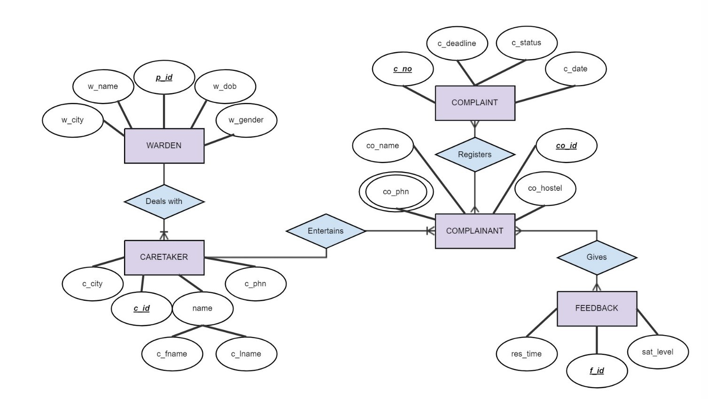

# hostel-complaint-management
## INTRODUCTION 
WARDEN: Represents the warden overseeing the residential facility. 

CARETAKER: Represents the caretaker responsible for managing complaints. 

COMPLAINANT: Represents the person lodging a complaint

COMPLAINT: Represents individual complaints. 

FEEDBACK: Captures feedback related to complaint handling.

WARDEN “Deals with” CARETAKER: The warden interacts with the caretaker to address complaints.

COMPLAINANT “Registers” a COMPLAINT: A complainant initiates a complaint.

CARETAKER “Entertains” both COMPLAINANT and COMPLAINT: The caretaker handles both complainants and their respective complaints.

FEEDBACK “Gives” information about satisfaction levels: Feedback informs how well complaints were handled.
## ER DIAGRAM

